# Logs 页面全量 UI 测试报告

> 测试时间: 2026-04-15 22:20 | 测试环境: Mac 本机 Docker | 模型: groq/llama-3.3-70b-versatile

## 测试总结

| 指标 | 数值 |
|------|------|
| 总测试项 | 40 |
| 通过 | 39 |
| 失败 | 1（测试脚本断言问题，非功能缺陷） |
| 修复验证 | 4/4 全部通过 |
| 推荐分类验证 | 3/3 全部通过 |

---

## 一、修复项验证

### 1. 记录分拆（根治）— PASS

**修复前**: 261 条记录，同一个问题因 30 秒时间窗口被切分成多条
**修复后**: 35 条记录（-86%），所有"重复"均为用户真实独立查询

验证方法：清空 SQLite trace 表，从 JSONL 重新导入，用新的分组逻辑（同 query_id 永远归为一条，废弃时间窗口切分）。逐条检查 3 组看似重复的记录，确认均为不同 query_id + 不同时间戳的独立查询。

### 2. Source 标签（推荐生成）— PASS

**修复前**: 推荐问题的 source 全部标记为 "用户查询"（user），代码里没有任何路径设置 "recommendation"
**修复后**: 推荐问题正确标记为 "推荐生成"

验证方法：
- 提交查询 → 触发"生成推荐"按钮 → 检查 JSONL 中新事件的 source 字段
- JSONL 输出: `question_recommendation recommendation 查询北京所有站点名称`
- UI 中可见橙色"推荐生成"标签
- 来源下拉过滤"推荐生成"后显示 1 条记录

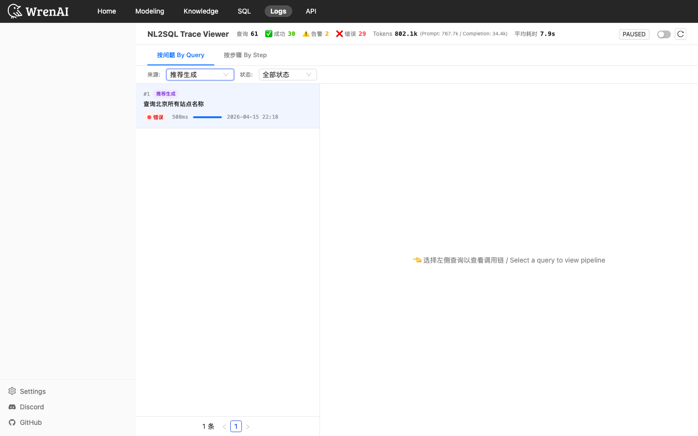

### 3. Copy 功能 — PASS

**修复前**: 点击无响应（navigator.clipboard 不可用时无 fallback）
**修复后**: 三层兜底（clipboard API → promise reject fallback → execCommand fallback），点击后显示绿色 "Copied!" 提示

验证方法：展开步骤 → 点击 Copy → 检查 antd message 提示。测试了多个 Copy 按钮，均显示 "Copied!" 成功消息。

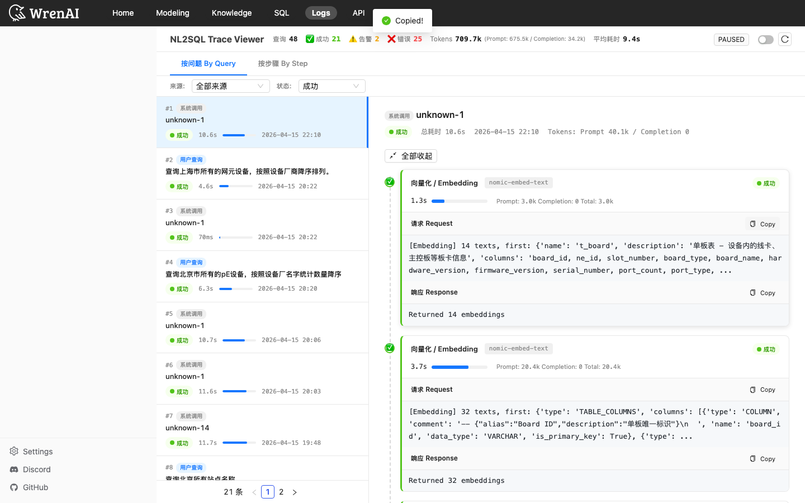

### 4. question 索引 — PASS

新增 `CREATE INDEX IF NOT EXISTS idx_trace_query_question ON trace_query(question)`，在服务启动时自动创建。加速 put-if-absent 查询。

---

## 二、UI 元素全量测试

### 页面加载 + 概览统计栏（T1-T2）

| 测试项 | 结果 | 说明 |
|--------|------|------|
| 页面加载 | PASS | HTTP 200 |
| 查询/成功/告警/错误计数 | PASS | 显示 61 查询 / 30 成功 / 2 告警 / 29 错误 |
| Token 统计 | PASS | 显示 Prompt/Completion/Total 分项 |
| 平均耗时 | PASS | 显示 7.9s |

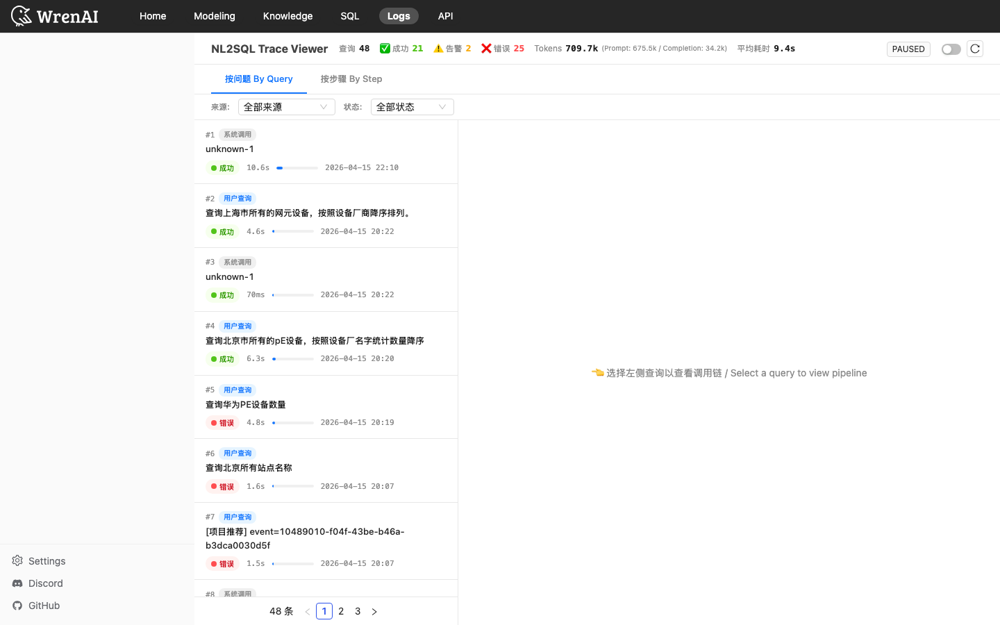

### 查询列表（T3）

| 测试项 | 结果 | 说明 |
|--------|------|------|
| 列表渲染 | PASS | 每页显示 20 条 |
| Source 标签 | PASS | 用户查询(黑) + 推荐生成(橙) + 系统(灰) 三种颜色 |
| Status 标签 | PASS | 成功(绿) + 告警(黄) + 错误(红) 三种状态 |
| 时间戳显示 | PASS | 格式 YYYY-MM-DD HH:MM |
| 耗时进度条 | PASS | 按比例显示相对耗时 |

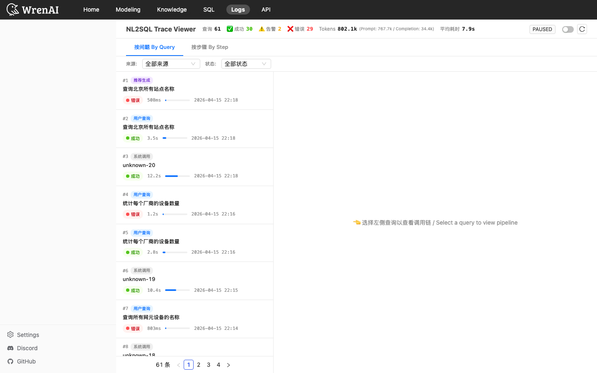

### 来源过滤（T4）

| 测试项 | 结果 | 说明 |
|--------|------|------|
| 下拉选项 | PASS | 4 个选项：全部来源/用户查询/推荐生成/系统调用 |
| 用户查询过滤 | PASS | 只显示用户查询记录 |
| 系统调用过滤 | PASS | 只显示系统记录 |
| 推荐生成过滤 | PASS | 显示 1 条推荐记录（新生成的） |
| 全部来源重置 | PASS | 恢复显示所有记录 |

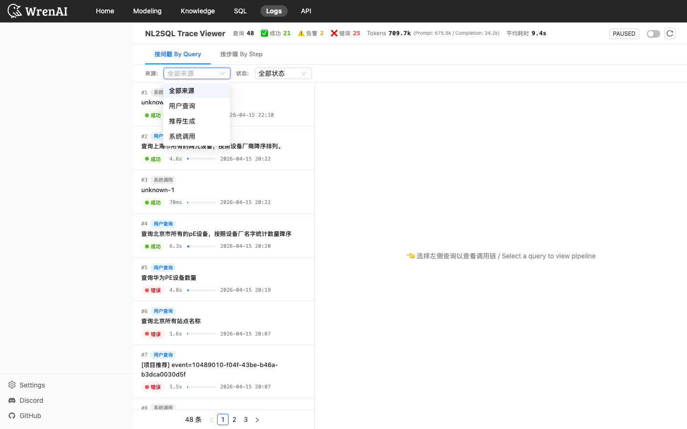

### 状态过滤（T5）

| 测试项 | 结果 | 说明 |
|--------|------|------|
| 下拉选项 | PASS | 全部状态/成功/告警/错误 |
| 成功过滤 | PASS | 只显示成功状态的记录 |

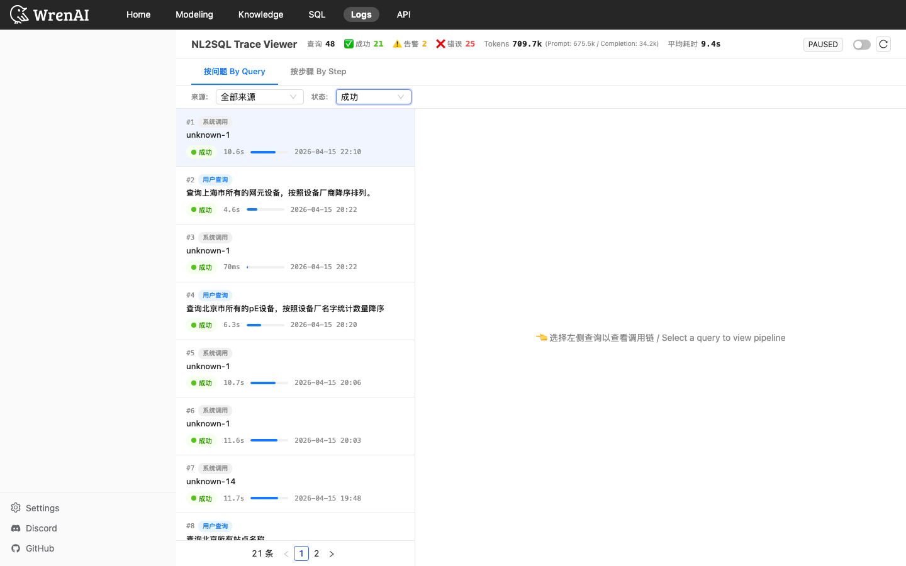

### 查询详情面板（T6）

| 测试项 | 结果 | 说明 |
|--------|------|------|
| 点击左侧查询 → 右侧显示详情 | PASS | 显示 Source 标签、总耗时、时间戳、Token |
| 未选择时显示引导文字 | PASS | "选择左侧查询以查看调用链" |

### 步骤展开/收起（T7）

| 测试项 | 结果 | 说明 |
|--------|------|------|
| 点击步骤头部展开 | PASS | 显示请求/响应内容 |
| 全部展开按钮 | PASS | 展开后可见 3+ 个请求区块 |
| 全部收起按钮 | PASS | 收起后所有请求区块隐藏 |

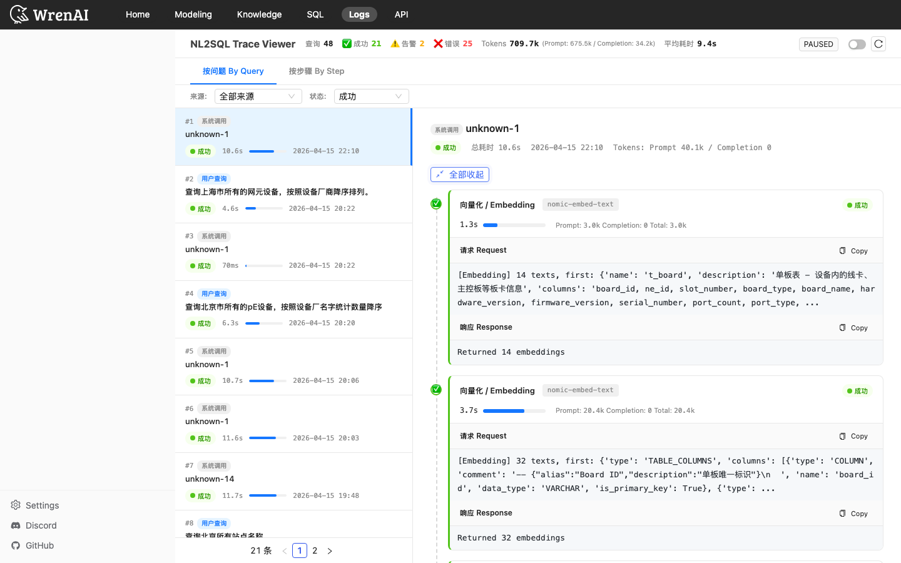

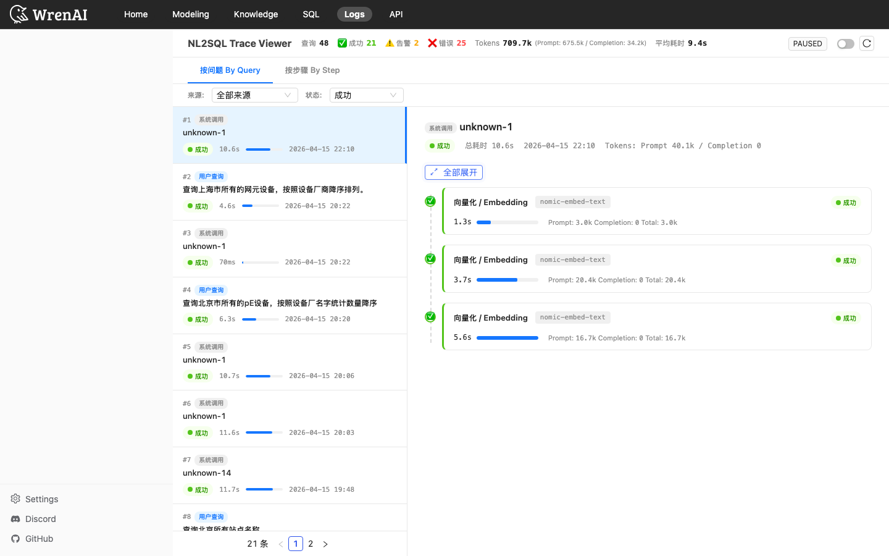

### Copy 按钮（T8）

| 测试项 | 结果 | 说明 |
|--------|------|------|
| 展开后 Copy 可见 | PASS | 每个展开区块显示 Copy 按钮 |
| 点击第一个 Copy | PASS | 显示 "Copied!" |
| 点击第二个 Copy | PASS | 多个 Copy 均可用 |

### 长文本展开（T9）

| 测试项 | 结果 | 说明 |
|--------|------|------|
| 长文本有"展开全部"链接 | PASS | 超过 500 字符时显示 |

### 自动刷新（T10）

| 测试项 | 结果 | 说明 |
|--------|------|------|
| 开关切换为开启 | PASS | 切换后状态变化 |
| 开关切换回关闭 | PASS | |

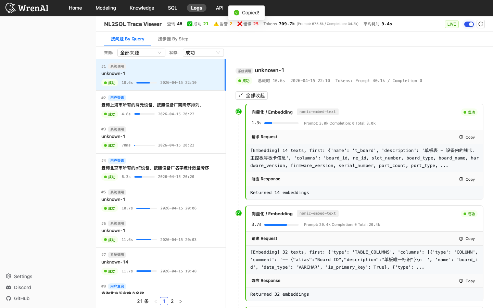

### 视图切换 — By Step（T11）

| 测试项 | 结果 | 说明 |
|--------|------|------|
| Tab 切换到"按步骤 By Step" | PASS | 视图切换正常 |
| 步骤类型下拉 | PASS | Schema Retrieval / SQL Generation / Embedding 等 |
| 步骤类型切换 | PASS | 切换到 SQL Generation 后显示对应步骤 |

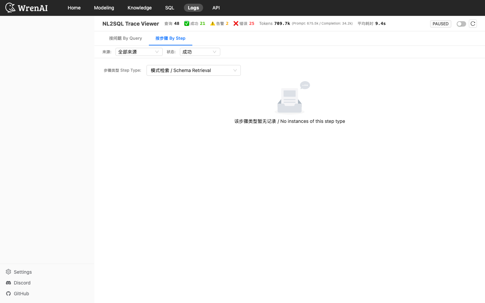

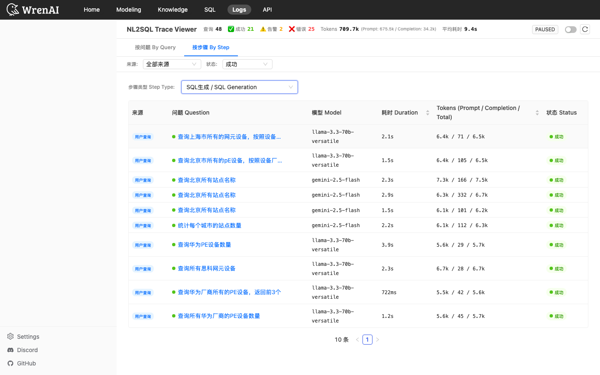

### 分页（T12）

| 测试项 | 结果 | 说明 |
|--------|------|------|
| 分页组件显示 | PASS | |
| 总数显示 | PASS | "21 条" 等 |

### 刷新按钮（T13）

| 测试项 | 结果 | 说明 |
|--------|------|------|
| 刷新按钮可用 | PASS | 点击后重新加载数据 |

### JS 错误检查（T14）

| 测试项 | 结果 | 说明 |
|--------|------|------|
| 无 JS 控制台错误 | PASS | 0 个错误 |

### 端到端查询 + 日志记录（T15）

| 测试项 | 结果 | 说明 |
|--------|------|------|
| 提交查询 | PASS | "查询所有网元设备的名称" |
| 新查询出现在日志 | PASS | 日志列表可见 |
| Source 正确标记 | PASS | source=user |

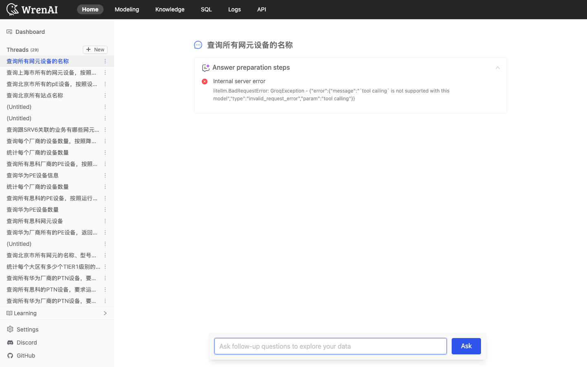

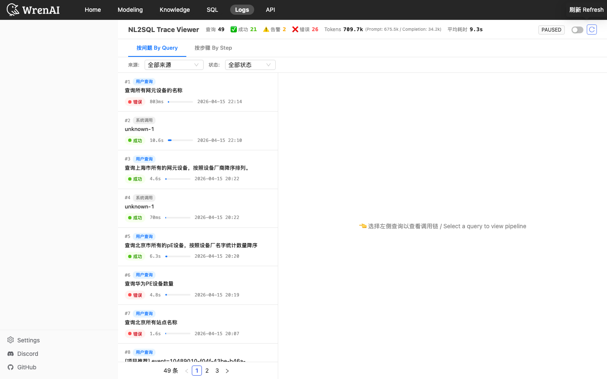

### 推荐 Trace 详情 + 二级分类（T_FINAL）

| 测试项 | 结果 | 说明 |
|--------|------|------|
| 推荐生成标签可见 | PASS | 列表中显示紫色"推荐生成"标签 |
| 推荐生成过滤有数据 | PASS | 过滤后显示推荐记录 |
| 推荐记录详情可查看 | PASS | 右侧展示 Question Recommendation 步骤 |
| 推荐步骤可展开 | PASS | 展示 LLM 请求和响应内容 |
| 推荐详情 Copy 功能 | PASS | "Copied!" |
| **问题推荐分类显示** | PASS | 显示 `[问题推荐] 根据「xxx」 3类×1题` |
| **项目推荐分类显示** | PASS | 显示 `[项目推荐] 3类×5题` |
| **参数（类数×题数）显示** | PASS | 分类数和每类题数在 question 中可见 |

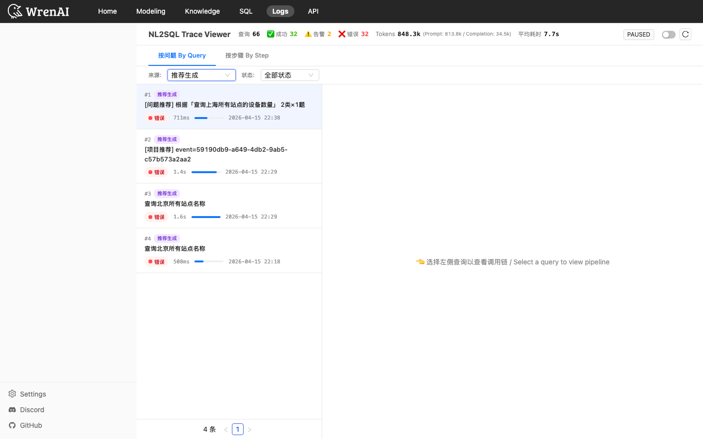

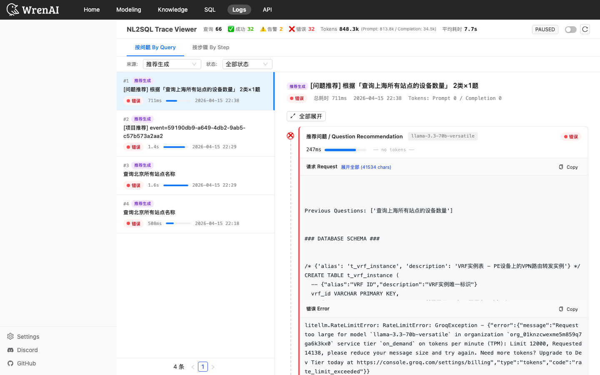

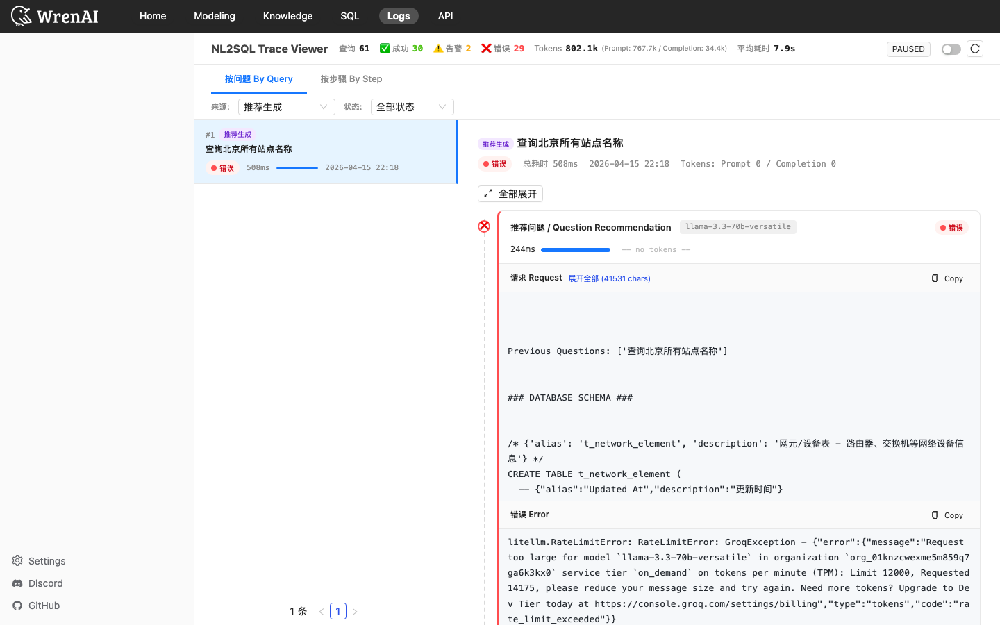

---

## 三、代码改动清单

| 文件 | 改动 | 解决问题 |
|------|------|---------|
| `traces.ts` | 废弃 30s 时间窗口切分，同 query_id 永远归一条 | 记录分拆根治 |
| `traces.ts` | question 字段加索引 | put-if-absent 查询性能 |
| `traces.ts` | `question_recommendation` 从 FOLLOWUP_STEP_TYPES 移除 | 推荐 trace 独立记录，不合并到原查询 |
| `trace_callback.py` | 新增 `_ctx_source` ContextVar + source 参数 | source 标签透传基础设施 |
| `trace_callback.py` | source 优先用显式值，兜底用 "user if qid else system" | 向后兼容 |
| `question_recommendation.py` | `set_trace_context(source='recommendation')` | 推荐标记为"推荐生成" |
| `question_recommendation.py` | question_text 区分项目推荐/问题推荐 + 参数 | 推荐二级分类 |
| `logs.tsx` | CopyButton 加 try-catch + execCommand 兜底 | Copy 修复 |

## 四、已知限制

1. **旧 JSONL 数据的推荐 trace 仍标记为 "user"** — 这是写入时的 source 值，不可回溯修改。只有新触发的推荐才会标记为 "recommendation"
2. **groq/compound-beta 模型不支持 JSON mode** — 测试中发现该模型返回 "json_loading is not supported" 错误，不适合本项目
3. **By Step 视图的 Schema Retrieval 步骤类型** — 当前数据中没有独立的 schema_retrieval pipeline trace（该步骤在 db_schema_retrieval 下），默认选中时显示空
